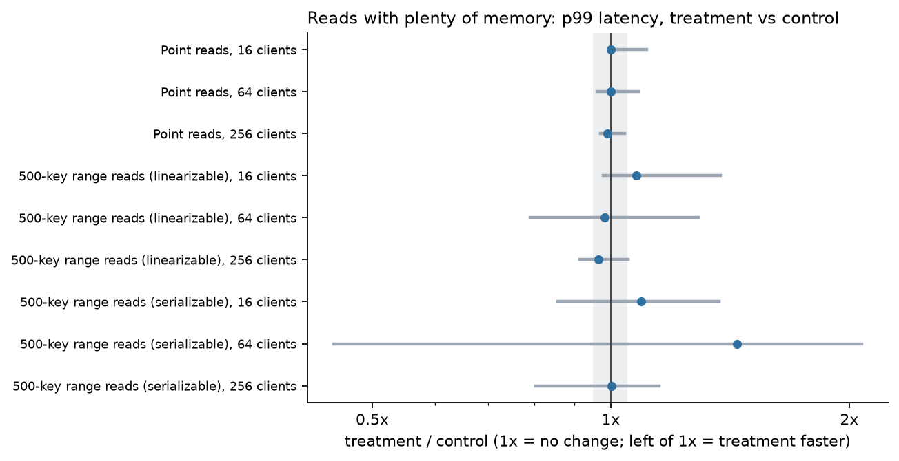
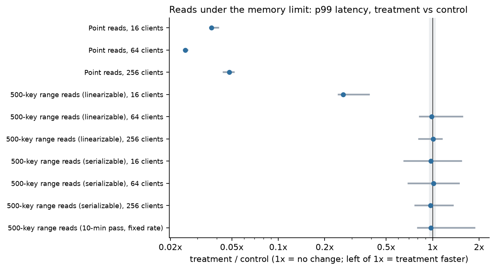
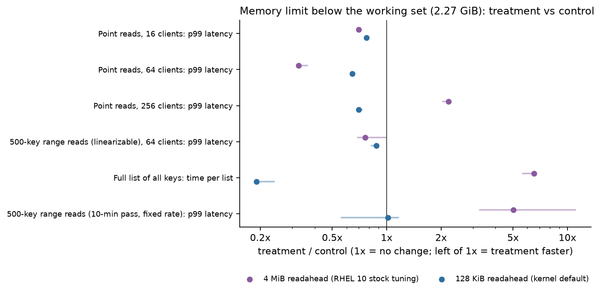
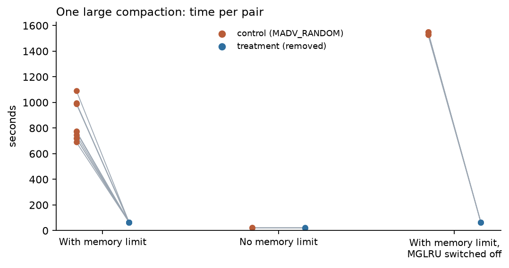
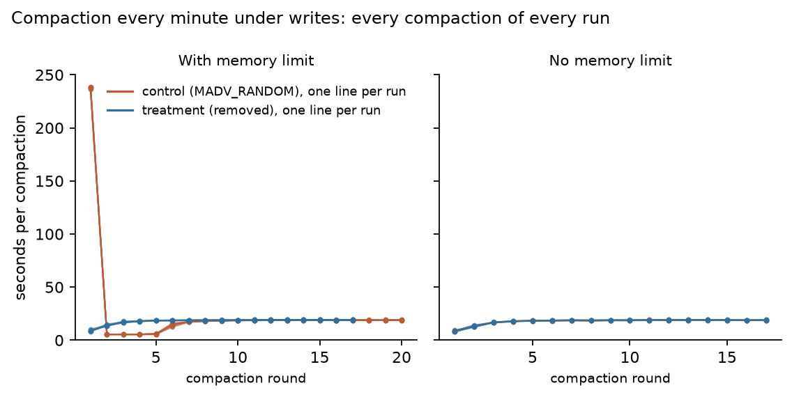
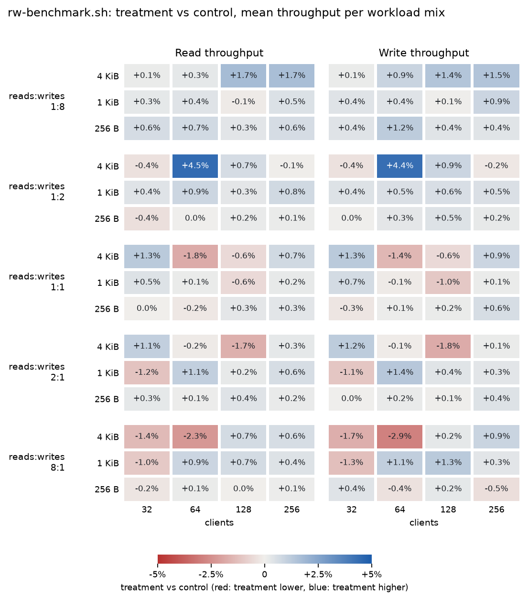

# bbolt MADV_RANDOM removal: etcd benchmark results

**Visual version of this report (charts with explanations, collapsible tables): <https://hasbro17.github.io/bbolt-madv-random-benchmark/>**

etcd stores its data in bbolt, which memory-maps the database file. bbolt calls `madvise(MADV_RANDOM)` on that mapping, which tells the kernel not to read ahead around page faults. Since Linux 6.4 (kernel commit `8788f678`, "mm: add vma_has_recency()"), the same flag also stops the kernel from counting accesses through the mapping as recent use, so etcd's cached database pages are among the first to be evicted under memory pressure. Compaction then reads them back from disk one 4 KiB page at a time and becomes much slower ([etcd-io/bbolt#939](https://github.com/etcd-io/bbolt/issues/939)).

The question asked on the issue: **does removing the `MADV_RANDOM` call affect performance other than compaction?** This report answers it with etcd's own benchmark tools (`tools/benchmark` and `tools/rw-heatmaps/rw-benchmark.sh`).

**Short answer: no.** Outside compaction, removing the call changes nothing with plenty of memory and makes reads faster under memory pressure. The one exception is a cache far smaller than etcd's working set combined with a very large readahead setting (4 MiB); with the kernel default (128 KiB) reads are faster there too.

**Scope: Linux 6.4 and later only** (tested on RHEL 10, kernel 6.12). These results say nothing about older kernels.

## Terms used

- **Control** and **treatment**: etcd `main` with bbolt v1.5.0 as shipped, and the same build with the `madvise(MADV_RANDOM)` call removed. Nothing else differs.
- **Memory limit**: etcd runs in a cgroup whose `MemoryMax` is below the size of its 8.6 GB database, so the kernel has to drop some of etcd's cached database pages and read them from disk again when they are needed ("memory pressure"). Main limit: 5.09 GiB (etcd's own memory plus 60% of the database), applied once etcd is running.
- **Pair**: one control run and one treatment run back to back on the same VM, from identical copies of the same database. Results are the median over pairs of treatment / control; "range over pairs" is the lowest and highest pair.
- **Noise band**: a difference counts only if it is larger than 5% or half the spread between pairs, whichever is bigger.
- **Major page fault**: etcd touched a database page that was not in memory, so the kernel read it from disk.
- **Readahead**: on a page fault the kernel also reads the data that follows, in one go (`read_ahead_kb` sets how much). `MADV_RANDOM` turns this off for the database file.
- **Working set**: the part of the database a workload keeps reading; for the read tests, mostly the current version of every key (a few GiB of the 8.6 GB database).
- **x**: "33x" means 33 times the control value; smaller changes are shown as percentages.

## Answer

Each row is one test scenario and the question it answers; the scenarios are described in the next section. S3 covers two scenarios, S3a and S3b.

| | Question | Answer | Key numbers |
|---|---|---|---|
| **S1** | With plenty of memory, do reads change? | No difference | Point-read throughput and p99 latency within -1.1% to +0.6% of control in S1 and in 10x longer runs (S1-long). The 500-key range reads vary more from pair to pair, for both builds, because they keep etcd's CPU saturated. |
| **S2** | Under memory pressure, are reads slower without `MADV_RANDOM`? | No: none of the 11 read-latency measures is slower than control beyond its noise band | Depending on the read type, treatment's latency is -97.5% to +1.4% against control (p99; time per list for the full list) |
| **S3** | Under memory pressure, is compaction slow with `MADV_RANDOM` and fast without it? | Yes: 11.9x faster without it | One large compaction (S3a) takes 773 s with `MADV_RANDOM` and 65.1 s without (median of 10 pairs). With compaction every minute under writes (S3b), the mean compaction drops from 26.9 s to 17.9 s and the slowest from 238 s to 19.2 s. |
| **S4** | Does etcd's own `rw-benchmark.sh` sweep change? | No difference | Across 60 workload mixes, median change against control is +0.3% for reads and +0.3% for writes; every mix within 4.5%. |

### In short

- **With plenty of memory, reads do not change:** point-read throughput and p99 latency are within -1.1% to +0.6% of control, also with 10x longer runs (S1, S1-long).
- **Under memory pressure, reads get faster without `MADV_RANDOM`:** 41x the point-read throughput at 64 clients, and a full list of all keys is 10.1x faster (S2).
- **Under memory pressure, compaction is 11.9x faster without `MADV_RANDOM`** (S3a), and 23.8x faster with the kernel's MGLRU switched off, so the problem is not specific to MGLRU.
- **One exception, when memory is smaller than the data etcd keeps reading:** it depends on the disk's readahead setting. With the kernel default (128 KiB), a full list is still 5.3x faster without `MADV_RANDOM`; with RHEL's stock 4 MiB readahead it is 6.5x slower, because each page fault pulls in up to 4 MiB and pushes out pages that are still needed (S2 follow-up).
- **etcd's rw-benchmark.sh shows no difference:** median +0.3% across 60 read/write workload mixes (S4).

## What each scenario does

| | Scenario | What it does | Why |
|---|---|---|---|
| **S1** | Reads, plenty of memory | Random point reads, 500-key range reads and a full list of all keys, at 16, 64 and 256 clients; no memory limit | Does the change affect normal reads? |
| **S2** | Reads, memory limited | The same reads under the memory limit, then 10 minutes of steady point and range reads | Without `MADV_RANDOM`, each page fault also reads nearby pages. Under memory pressure those extra pages could push out useful ones, so this is where the change is most likely to hurt |
| **S3a** | One large compaction, memory limited | Compact 1,050,000 old revisions of an 8.6 GB database in one go and time it | The reported problem in its simplest form: the same work for both builds, one number per run |
| **S3b** | Writes with compaction every minute, memory limited | 900,000 writes at a target of 1,000 per second (about 15 minutes), a compaction every 60 seconds, background point reads | Closer to a busy production cluster: compaction runs while clients read and write |
| **S4** | etcd's rw-benchmark.sh | The unmodified read/write throughput sweep: 5 read:write ratios, 3 value sizes, 4 client counts, each from an empty database that grows (bbolt remaps the file, applying the `madvise` call each time) | Does the change cost anything for writes and mixed traffic in normal operation? Plenty of memory, so no page-cache effect is expected; S1 covers only reads |

The scenarios ran in parallel on five identical VMs. Each scenario, together with its run without a memory limit, ran entirely on one VM, and only numbers from the same VM are compared.

## S1: reads with plenty of memory

**Result:** No difference. Point-read throughput and p99 latency are within -1.0% to +0.6% of control; the 500-key range reads vary from pair to pair for both builds and stay within their noise band.

Random point reads, 500-key range reads and a full list of all keys, at 16, 64 and 256 clients, with no memory limit: etcd's whole database stays cached, so both builds are expected to be equal.

*How to read the chart:* Each row is one kind of read. The dot is treatment's p99 latency relative to control (median pair) and the line spans all pairs; the shaded band is ±5%. Left of 1x means treatment is faster, right of 1x slower. The axis is logarithmic, so equal distances mean equal ratios (0.5x and 2x are the same distance from 1x).

5 pairs, no memory limit.

Full table (19 measures)

| Measure | Control (median run) | Treatment (median run) | Treatment vs control (median pair) | Range over pairs |
|---|--:|--:|--:|--:|
| Point reads, 16 clients: throughput | 43,787/s | 43,849/s | -0.3% | -1.9% to +0.7% |
| Point reads, 16 clients: p99 latency | 0.90 ms | 0.90 ms | 0.0% | 0.0% to +11.1% |
| Point reads, 64 clients: throughput | 68,096/s | 68,352/s | +0.6% | -4.3% to +0.8% |
| Point reads, 64 clients: p99 latency | 2.50 ms | 2.50 ms | 0.0% | -4.0% to +8.3% |
| Point reads, 256 clients: throughput | 75,010/s | 74,745/s | -0.3% | -2.1% to +2.0% |
| Point reads, 256 clients: p99 latency | 9.80 ms | 9.90 ms | -1.0% | -2.9% to +4.2% |
| 500-key range reads (linearizable), 16 clients: throughput | 211/s | 199/s | -9.8% | -30.4% to +6.3% |
| 500-key range reads (linearizable), 16 clients: p99 latency | 139 ms | 150 ms | +7.7% | -2.1% to +37.7% |
| 500-key range reads (linearizable), 64 clients: throughput | 217/s | 211/s | +0.4% | -29.0% to +31.2% |
| 500-key range reads (linearizable), 64 clients: p99 latency | 659 ms | 663 ms | -1.7% | -20.9% to +28.9% |
| 500-key range reads (linearizable), 256 clients: throughput | 221/s | 219/s | -2.7% | -26.3% to +30.2% |
| 500-key range reads (linearizable), 256 clients: p99 latency | 4,014 ms | 3,795 ms | -3.6% | -8.7% to +5.1% |
| 500-key range reads (serializable), 16 clients: throughput | 204/s | 196/s | -3.1% | -28.3% to +10.4% |
| 500-key range reads (serializable), 16 clients: p99 latency | 148 ms | 167 ms | +9.3% | -14.3% to +37.1% |
| 500-key range reads (serializable), 64 clients: throughput | 221/s | 213/s | -3.8% | -29.2% to +34.6% |
| 500-key range reads (serializable), 64 clients: p99 latency | 760 ms | 997 ms | +44.4% | -55.3% to +107.6% |
| 500-key range reads (serializable), 256 clients: throughput | 231/s | 239/s | +4.6% | -14.2% to +32.9% |
| 500-key range reads (serializable), 256 clients: p99 latency | 4,654 ms | 4,820 ms | +0.2% | -19.5% to +15.0% |
| Full list of all keys: time per list | 3,295 ms | 3,218 ms | -2.0% | -3.9% to +4.5% |

## S1-long: the same point reads, 10 times longer

**Result:** No difference with longer runs either: point-read throughput within -1.1% to -0.5% of control, and p99 latency unchanged (0.0% at every client count).

S1's point-read runs are short (20,000, 80,000 and 320,000 requests: 0.5, 1.2 and 4.3 seconds). S1-long repeats S1 with 10 times as many requests (about 4, 11 and 42 seconds), to make sure the short runs did not hide a difference.

5 pairs, no memory limit.

Full table (6 measures)

| Measure | Treatment vs control (median pair) | Range over pairs |
|---|--:|--:|
| Point reads, 16 clients: throughput | -1.1% | -1.4% to +1.6% |
| Point reads, 16 clients: p99 latency | 0.0% | -11.1% to +12.5% |
| Point reads, 64 clients: throughput | -0.6% | -1.3% to +3.8% |
| Point reads, 64 clients: p99 latency | 0.0% | -4.0% to 0.0% |
| Point reads, 256 clients: throughput | -0.5% | -1.7% to +2.5% |
| Point reads, 256 clients: p99 latency | 0.0% | -3.0% to +2.0% |

## S2: reads under memory pressure

**Result:** Reads are faster without `MADV_RANDOM`: 18.9x to 41.4x the point-read throughput and a full list of all keys is 10.1x faster; no read type is slower than control beyond its noise band.

The same reads as S1 under the memory limit, followed by 10 minutes of steady point and range reads. Under the limit, treatment keeps the data these reads touch in memory, while control keeps losing it and reading it back from disk (see the disk-read and page-fault rows). The last column shows how much the same measure varies between pairs in S1, without a memory limit: the 500-key range reads keep etcd's CPU saturated, so they vary a lot in every scenario.

*How to read the chart:* Each row is one kind of read. The dot is treatment's p99 latency relative to control (median pair) and the line spans all pairs; the shaded band is ±5%. Left of 1x means treatment is faster, right of 1x slower. The axis is logarithmic, so equal distances mean equal ratios (0.5x and 2x are the same distance from 1x).

10 pairs, memory limit 5.09 GiB.

Full table (24 measures)

| Measure | Control (median run) | Treatment (median run) | Treatment vs control (median pair) | Range over pairs | Range over pairs in S1 (no memory limit) |
|---|--:|--:|--:|--:|--:|
| Point reads, 16 clients: throughput | 1,302/s | 43,609/s | 33.4x | 32.5x to 33.9x | -1.9% to +0.7% |
| Point reads, 16 clients: p99 latency | 24.5 ms | 0.90 ms | -96.3% | -96.4% to -95.9% | 0.0% to +11.1% |
| Point reads, 64 clients: throughput | 1,654/s | 68,485/s | 41.4x | 39.8x to 41.7x | -4.3% to +0.8% |
| Point reads, 64 clients: p99 latency | 101 ms | 2.50 ms | -97.5% | -97.6% to -97.4% | -4.0% to +8.3% |
| Point reads, 256 clients: throughput | 3,980/s | 75,378/s | 18.9x | 18.3x to 19.0x | -2.1% to +2.0% |
| Point reads, 256 clients: p99 latency | 205 ms | 9.75 ms | -95.2% | -95.6% to -94.8% | -2.9% to +4.2% |
| 500-key range reads (linearizable), 16 clients: throughput | 203/s | 231/s | +13.4% | -25.9% to +47.4% | -30.4% to +6.3% |
| 500-key range reads (linearizable), 16 clients: p99 latency | 481 ms | 126 ms | -73.7% | -75.3% to -61.3% | -2.1% to +37.7% |
| 500-key range reads (linearizable), 64 clients: throughput | 226/s | 234/s | +4.1% | -38.2% to +22.0% | -29.0% to +31.2% |
| 500-key range reads (linearizable), 64 clients: p99 latency | 605 ms | 611 ms | -1.2% | -17.5% to +55.7% | -20.9% to +28.9% |
| 500-key range reads (linearizable), 256 clients: throughput | 238/s | 238/s | -0.9% | -37.4% to +40.7% | -26.3% to +30.2% |
| 500-key range reads (linearizable), 256 clients: p99 latency | 4,002 ms | 3,961 ms | +0.6% | -18.2% to +14.8% | -8.7% to +5.1% |
| 500-key range reads (serializable), 16 clients: throughput | 220/s | 229/s | +4.8% | -37.4% to +56.3% | -28.3% to +10.4% |
| 500-key range reads (serializable), 16 clients: p99 latency | 140 ms | 132 ms | -2.5% | -34.6% to +53.1% | -14.3% to +37.1% |
| 500-key range reads (serializable), 64 clients: throughput | 233/s | 237/s | +1.7% | -34.8% to +18.6% | -29.2% to +34.6% |
| 500-key range reads (serializable), 64 clients: p99 latency | 838 ms | 886 ms | +1.4% | -30.3% to +48.0% | -55.3% to +107.6% |
| 500-key range reads (serializable), 256 clients: throughput | 242/s | 247/s | +2.0% | -31.4% to +50.3% | -14.2% to +32.9% |
| 500-key range reads (serializable), 256 clients: p99 latency | 4,697 ms | 4,601 ms | -3.1% | -22.7% to +35.5% | -19.5% to +15.0% |
| Full list of all keys: time per list | 33.0 s | 3.29 s | -90.1% | -90.2% to -89.6% | -3.9% to +4.5% |
| Point reads (10-min pass, fixed rate): throughput | 2,000/s | 2,000/s | 0.0% | 0.0% to 0.0% | n/a |
| 500-key range reads (10-min pass, fixed rate): throughput | 20.0/s | 20.0/s | 0.0% | 0.0% to 0.0% | n/a |
| 500-key range reads (10-min pass, fixed rate): p99 latency | 28.3 ms | 26.3 ms | -2.4% | -19.5% to +87.4% | n/a |
| Major page faults, whole run | 519,162 | 4 | -100.0% | -100.0% to -100.0% | n/a |
| Disk read, whole run | 2,057 MiB | 0.00 MiB | -100.0% | -100.0% to -100.0% | n/a |

## S2 follow-up: memory below the working set, and readahead

**Result:** With a 4 MiB readahead, large reads get slower (full list 6.5x slower, p99 of point reads at 256 clients 2.2x slower); with the 128 KiB default, treatment is faster (full list 5.3x faster).

`MADV_RANDOM` was originally added (boltdb/bolt#383) to stop readahead from wasting disk reads when the database does not fit in memory. In the main S2 run that situation never arises: after the limit is applied, treatment's working set still fits. So the same S2 was also run with a tighter limit, 2.27 GiB, which is below the working set, so both builds keep reading from disk. It was run twice:

- with RHEL 10's stock readahead, `read_ahead_kb=4096` (4 MiB), and
- with the kernel default, `read_ahead_kb=128` (128 KiB).

Control is not affected by this setting, because `MADV_RANDOM` turns readahead off. Values are treatment against control per pair: for throughput higher is better; for time, latency, disk reads and faults lower is better.

*How to read the chart:* Each row is one measure under the tighter limit. The dots show treatment relative to control (median pair, line = all pairs), once with 4 MiB readahead (purple) and once with 128 KiB (blue). Left of 1x means treatment is faster.

Full table (9 measures)

| Measure | 4 MiB readahead: treatment vs control | Range over pairs | 128 KiB readahead: treatment vs control | Range over pairs |
|---|--:|--:|--:|--:|
| Point reads, 16 clients: throughput | +90.4% | +87.5% to +92.9% | +60.8% | +60.0% to +64.0% |
| Point reads, 64 clients: throughput | 4.6x | 3.8x to 4.7x | +61.8% | +59.6% to +64.8% |
| Point reads, 256 clients: throughput | -14.4% | -19.2% to -5.6% | +62.7% | +61.3% to +65.3% |
| Point reads, 256 clients: p99 latency | 2.2x | 2.1x to 2.2x | -29.8% | -30.7% to -27.3% |
| 500-key range reads (linearizable), 64 clients: p99 latency | -24.1% | -30.6% to -0.5% | -12.1% | -17.4% to -9.6% |
| Full list of all keys: time per list | 6.5x | 5.7x to 6.6x | -81.0% | -81.1% to -76.2% |
| 500-key range reads (10-min pass, fixed rate): p99 latency | 5.0x | 3.3x to 11.1x | +1.7% | -43.8% to +16.2% |
| Disk read, whole run | 77.4x | 76.8x to 95.8x | +68.6% | +65.1% to +80.5% |
| Major page faults, whole run | -84.9% | -89.3% to -80.4% | -59.8% | -61.2% to -57.8% |

4 MiB: 3 pairs. 128 KiB: 3 pairs. Same scenario and limit; only the readahead setting of the data disk differs. The two settings ran on two different VMs, so only the treatment / control ratios are compared, never the absolute numbers.

In short: with a 4 MiB readahead, each fault pulls in so much extra data that it pushes out pages that are still needed, and large reads get slower. With the default 128 KiB, treatment is faster than control on every read measure except the p99 latency of 500-key range reads (10-min pass, fixed rate), which is within noise. It reads 1.7x as much from disk as control.

## S3a: one large compaction under memory pressure

**Result:** Compaction is 11.9x faster without `MADV_RANDOM` (773 s to 65.1 s), with major page faults down from 995,357 to 261.

etcd starts on a database holding 1,050,000 old revisions, the memory limit is applied, and one `etcdctl compact` removes them. The time is taken from etcd's own "finished scheduled compaction" log line.

*How to read the chart:* Compaction time in three setups: with the memory limit, without it, and with the memory limit and the kernel's MGLRU switched off. Each bar and its number is the median run of one build; each dot is one run. Lower is better.

10 pairs, memory limit 5.09 GiB.

Full table (4 measures)

| Measure | Control (median run) | Treatment (median run) | Treatment vs control (median pair) | Range over pairs |
|---|--:|--:|--:|--:|
| Compaction time | 773 s | 65.1 s | -91.6% | -94.0% to -90.6% |
| Major page faults during compaction | 995,357 | 261 | -100.0% | -100.0% to -100.0% |
| Disk read during compaction | 4,027 MiB | 8,197 MiB | +103.4% | +41.5% to +127.9% |
| Backend commit p99 latency | 4.00 ms | 64.0 ms | 16.0x | 16.0x to 16.0x |

Treatment reads more bytes from disk than control, but in large readahead chunks instead of one 4 KiB page per fault, which is why it is much faster. There is no client traffic in S3a, so "backend commit p99 latency" covers only the compaction's own batch commits (about 2,450 per run); etcd reports it in coarse buckets (4, 8, 16, 32, 64 ms, ...), so the values are bucket bounds. Treatment does those commits in about a minute while readahead keeps the disk busy, so some of them wait longer. Client writes during compaction are measured in S3b.

## S3a without a memory limit

**Result:** No difference: every measure within 0.3% of control.

The same compaction with no memory limit. Both builds compact equally fast, so the memory limit is what triggers the slowdown.

3 pairs, no memory limit.

| Measure | Control (median run) | Treatment (median run) | Treatment vs control (median pair) | Range over pairs |
|---|--:|--:|--:|--:|
| Compaction time | 21.8 s | 21.8 s | -0.3% | -0.6% to +0.6% |

## S3b: compaction every minute under writes

**Result:** The slowest compaction per run drops from 238 s to 19.2 s and the mean from 26.9 s to 17.9 s; writes run at 858 instead of 704 per second, with p99.9 latency of 48.9 ms instead of 755 ms.

900,000 writes at a target rate of 1,000 per second (about 15 minutes) with a compaction every 60 seconds and background point reads, under the memory limit. Each run makes the same number of writes, so a slower run lasts longer and goes through more compaction rounds: compare per-compaction times and latencies, not totals. Neither build reaches the 1,000 per second target even without a memory limit (about 860 per second, see below); that is a limit of this setup and the same for both.

*How to read the chart:* Every compaction of every run, in the order they ran, with the memory limit (left) and without it (right). Each line is one run: orange for control, blue for treatment. The benchmark requests a compaction every 60 seconds. Lower is better.

5 pairs, memory limit 5.09 GiB.

Full table (10 measures)

| Measure | Control (median run) | Treatment (median run) | Treatment vs control (median pair) | Range over pairs |
|---|--:|--:|--:|--:|
| Writes: throughput | 704/s | 858/s | +21.7% | +21.2% to +22.0% |
| Writes: p99 latency | 46.3 ms | 43.8 ms | -5.6% | -5.6% to -4.8% |
| Writes: p99.9 latency | 755 ms | 48.9 ms | -93.5% | -93.6% to -93.5% |
| Background point reads: throughput | 489/s | 484/s | -1.0% | -1.1% to -0.9% |
| Slowest compaction | 238 s | 19.2 s | -91.9% | -91.9% to -91.9% |
| Mean compaction time | 26.9 s | 17.9 s | -33.4% | -33.6% to -33.2% |
| Median compaction time | 18.8 s | 18.8 s | +0.3% | -0.5% to +0.5% |
| Compaction rounds per run | 20 | 17 | -15.0% | -15.0% to -15.0% |
| Major page faults per second | 392/s | 0.00/s | -100.0% | -100.0% to -100.0% |
| Disk read per second | 1.57 MiB/s | 0.00 MiB/s | -100.0% | -100.0% to -100.0% |

In every control run the stall is the first compaction after the memory limit is applied (236 s to 238 s). After it, control's next four compactions are shorter than treatment's at the same point (5.4 s to 6.2 s, against 13.6 s to 18.7 s for treatment), and then both builds settle at about 19 s per compaction.

## S3b without a memory limit

**Result:** No difference: every measure within 2.0% of control.

The same workload with no memory limit: both builds are equal.

3 pairs, no memory limit.

Full table (5 measures)

| Measure | Control (median run) | Treatment (median run) | Treatment vs control (median pair) | Range over pairs |
|---|--:|--:|--:|--:|
| Writes: throughput | 860/s | 859/s | -0.1% | -0.5% to +0.2% |
| Writes: p99.9 latency | 48.8 ms | 48.8 ms | 0.0% | -0.2% to +0.2% |
| Slowest compaction | 19.1 s | 19.1 s | +0.3% | -0.2% to +2.7% |
| Mean compaction time | 17.7 s | 17.7 s | +0.2% | -0.6% to +1.9% |
| Median compaction time | 18.7 s | 18.8 s | +0.8% | +0.7% to +1.8% |

## S4: etcd's rw-benchmark.sh

**Result:** No difference. Across 60 workload mixes, median change against control is +0.3% for reads and +0.3% for writes; every mix within 4.5%.

etcd's `tools/rw-heatmaps/rw-benchmark.sh`, unmodified: workload mixes of read:write ratios from 1:8 to 8:1, values of 256 B, 1 KiB and 4 KiB, and 32 to 256 clients, each starting from an empty database, with plenty of memory. The script runs each mix 5 times per build and reports the mean throughput; values are treatment against control for that mean.

The chart uses the layout of the comparison images from etcd's `tools/rw-heatmaps`. That tool itself could not draw this sweep: it only plots value sizes in 2x steps, and this reduced sweep skips 512 B and 2 KiB (`docs/METHODS.md`, item 4).

*How to read the chart:* Each square is one workload mix, and its number is treatment's mean throughput relative to control. Each row of panels is one read:write ratio; inside a panel, columns are client counts and rows are value sizes. Left panels show reads, right panels writes; both come from the same runs of a mix. The colour scale is the same in every panel and runs from -5% (red, treatment lower) to +5% (blue, treatment higher), the noise band: pale squares are close to no change. A real effect would show up as a block of one colour, such as a whole row, column or panel.

| 60 workload mixes | Treatment vs control (median over mixes) | Range over mixes |
|---|--:|--:|
| Read throughput | +0.3% | -2.3% to +4.5% |
| Write throughput | +0.3% | -2.9% to +4.4% |

S4 check: did the VM drift between the two sweeps?

S4 runs the whole control sweep first and the whole treatment sweep about 7 hours later. To check that the VM itself did not change in between, the first 8 workload mixes were run again with control after the treatment sweep. Values are mean throughput per mix.

| Workload mix | | Control | Control, run again afterwards | Control again vs control | Treatment vs control |
|---|---|--:|--:|--:|--:|
| reads:writes 1:8, 32 clients, 256 B values | reads/s | 556 | 556 | +0.1% | +0.6% |
| reads:writes 1:8, 32 clients, 256 B values | writes/s | 4,437 | 4,445 | +0.2% | +0.4% |
| reads:writes 1:8, 32 clients, 1 KiB values | reads/s | 528 | 529 | +0.1% | +0.3% |
| reads:writes 1:8, 32 clients, 1 KiB values | writes/s | 4,194 | 4,218 | +0.6% | +0.4% |
| reads:writes 1:8, 64 clients, 256 B values | reads/s | 789 | 792 | +0.4% | +0.7% |
| reads:writes 1:8, 64 clients, 256 B values | writes/s | 6,288 | 6,339 | +0.8% | +1.2% |
| reads:writes 1:8, 64 clients, 1 KiB values | reads/s | 760 | 765 | +0.7% | +0.4% |
| reads:writes 1:8, 64 clients, 1 KiB values | writes/s | 6,077 | 6,086 | +0.2% | +0.4% |
| reads:writes 1:8, 128 clients, 256 B values | reads/s | 1,082 | 1,089 | +0.6% | +0.3% |
| reads:writes 1:8, 128 clients, 256 B values | writes/s | 8,689 | 8,702 | +0.1% | +0.4% |
| reads:writes 1:8, 128 clients, 1 KiB values | reads/s | 1,047 | 1,047 | 0.0% | -0.1% |
| reads:writes 1:8, 128 clients, 1 KiB values | writes/s | 8,388 | 8,457 | +0.8% | +0.1% |
| reads:writes 1:8, 256 clients, 256 B values | reads/s | 1,538 | 1,543 | +0.3% | +0.6% |
| reads:writes 1:8, 256 clients, 256 B values | writes/s | 12,329 | 12,345 | +0.1% | +0.4% |
| reads:writes 1:8, 256 clients, 1 KiB values | reads/s | 1,463 | 1,472 | +0.7% | +0.5% |
| reads:writes 1:8, 256 clients, 1 KiB values | writes/s | 11,684 | 11,782 | +0.8% | +0.9% |

Control run again vs the first control sweep: median +0.3% (0.0% to +0.8%). Treatment vs control on the same mixes: median +0.4% (-0.1% to +1.2%). The two shifts are the same size, so the small difference between the sweeps comes from the VM, not from the change.

## More results

Side measurements that support the main results; expand any of them.

Compaction with MGLRU switched off

**Result:** Still 23.8x faster without `MADV_RANDOM` (1,549 s to 65.1 s), so the slowdown is not specific to MGLRU.

The S3a compaction with the kernel's MGLRU page-reclaim mode switched off, to test whether MGLRU is what triggers the slowdown. It is not: without MGLRU control is slower still. It reads the whole database once, one 4 KiB page per fault, while treatment reads the same bytes in large readahead chunks.

5 pairs, memory limit 5.09 GiB.

| Measure | Control (median run) | Treatment (median run) | Treatment vs control (median pair) | Range over pairs |
|---|--:|--:|--:|--:|
| Compaction time | 1,549 s | 65.1 s | -95.8% | -95.8% to -95.7% |
| Major page faults during compaction | 2,032,965 | 275 | -100.0% | -100.0% to -100.0% |
| Disk read during compaction | 8,226 MiB | 8,198 MiB | -0.4% | -0.4% to -0.3% |

etcd startup under a memory limit

**Result:** Treatment becomes healthy 8.2x faster (2,797 s for control, 341 s for treatment).

One run per build, not pairs: etcd started with a memory limit already in place, so its startup (which reads every revision to rebuild its index) runs under pressure. Without a limit startup takes 80.0 s.

| Build | Time until etcd is healthy | Memory limit |
|---|--:|--:|
| control | 2,797 s | 3.48 GiB |
| treatment | 341 s | 3.48 GiB |

The control run was stopped during the compaction that followed startup, to save time; its startup time is complete.

Compaction time at three memory limits

**Result:** Treatment stays at 65.2 s to 65.3 s at every limit, while control takes 984 s to 1,279 s.

The S3a compaction at three memory limits on one VM, one run per build at each limit, to show how the effect grows with pressure.

| Memory limit (etcd's memory plus this share of the database) | Limit | Control | Treatment | Treatment vs control |
|---|--:|--:|--:|--:|
| 60% | 5.09 GiB | 984 s | 65.2 s | 15.1x faster |
| 40% | 3.48 GiB | 1,204 s | 65.2 s | 18.5x faster |
| 25% | 2.27 GiB | 1,279 s | 65.3 s | 19.6x faster |

## Caveats and method notes

- **Readahead size.** RHEL 10's stock tuning profile (`virtual-guest`) sets `read_ahead_kb=4096` (4 MiB) on the data disk; the kernel default is 128 KiB. Without `MADV_RANDOM`, every page fault on the database can read that much data. Readahead is what makes compaction fast without `MADV_RANDOM`, but with a memory limit below the working set a 4 MiB readahead makes large reads slower (see the S2 follow-up). All compaction runs (S3a, S3b) used the 4 MiB setting; compaction with the 128 KiB default was not measured. At 128 KiB each fault still reads 32 pages instead of one, so compaction is expected to stay limited by disk throughput, as it was here. Distributions and tuning profiles differ, so check `read_ahead_kb` on etcd's data disk.
- **When the memory limit is applied.** The limit is set once etcd is running, which models a running etcd that comes under memory pressure. With the limit in place from the start, startup itself becomes much slower (see "More results").
- **Random point reads** use `benchmark stm` with one key per transaction and no writes. `benchmark range` and `txn-mixed` always read the same keys, so they never touch random pages of the database.
- **Latencies left out.** Two steps run `benchmark stm` at a fixed rate (the 10-minute pass in S2, the background reads in S3b). `stm` waits for its rate limiter inside the timed part of each request, so with `--rate` the recorded latency is mostly that wait (clients divided by rate, for example 64 / 2,000 per second = 32 ms, the same for both builds). Only their throughput is shown, which tells whether each build kept up with the target rate. `put` and `range` start the clock after the wait, so their latencies are shown.
- **How S3b is judged.** S3b uses the mean compaction time per run plus major faults, not the median: control's damage is one stalled compaction per run (the first after the memory limit is applied) that a median hides. This was decided after 2 of 5 pairs, before the rest ran (`docs/METHODS.md`). Median, mean and slowest are all in the table.
- **Same-VM comparisons only.** Absolute numbers differ between VMs (control's S3a compaction took 771 to 1,123 s on the three VMs in the check before the main runs), so every comparison is within one VM.

## Appendix: environment and method

- Hosts: 5 identical VMs, each with kernel `6.12.0-211.53.1.el10_2.x86_64` and `read_ahead_kb=4096` on the data disk
- Versions, binary checksums, dataset and memory limit: `docs/VERSIONS.md`, `docs/DATASET.md`, `docs/PRESSURE.md`.
- Every failure, fix and rerun: `docs/METHODS.md`. Raw per-run data, including failed and superseded attempts, is in the [raw-data release](https://github.com/hasbro17/bbolt-madv-random-benchmark/releases/tag/raw-data-2026-10-03).
- Reproduce: `docs/REPRODUCE.md` and `scripts/`; any Linux 6.4+ host with cgroup v2.

